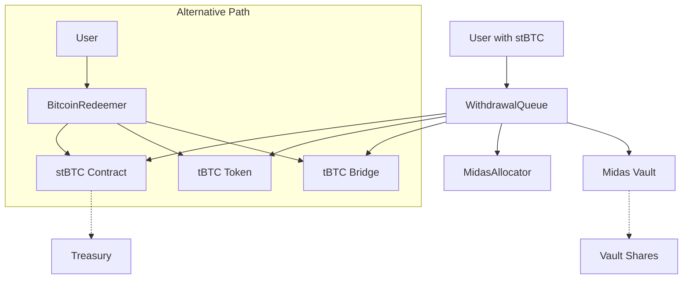

# WithdrawalQueue Contract Documentation

## Overview

The `WithdrawalQueue` contract is a core component of the Acre protocol that manages asynchronous withdrawals from the Midas Vault back to Bitcoin. It serves as an intermediary between users holding acreBTC tokens and the underlying Midas Vault infrastructure, facilitating both simple redemptions and Bitcoin bridge withdrawals.

## Architecture & Integration

### Contract Dependencies

The WithdrawalQueue integrates with several key contracts:

1. **acreBTC** - The ERC4626 vault token representing staked Bitcoin
2. **MidasAllocator** - Manages allocation of tBTC to/from Midas Vault
3. **Midas Vault (IVault)** - External yield-generating vault for tBTC
4. **tBTC Token** - The underlying Bitcoin-backed token
5. **BitcoinRedeemer** - Alternative direct redemption path (for comparison)



## Core Functionality

### 1. Withdrawal Request Structure

```solidity
struct RedeemAndBridgeRequest {
    address redeemer;          // User initiating withdrawal
    uint256 shares;            // Midas vault shares amount
    uint256 tbtcAmount;        // Equivalent tBTC amount
    uint256 createdAt;         // Request creation timestamp
    uint256 completedAt;       // Request completion timestamp
    bool isCompleted;          // Completion status
    bytes20 walletPubKeyHash;  // Bitcoin wallet for bridge withdrawal
    uint256 midasRequestId;    // Associated Midas vault request ID
}
```

### 2. Withdrawal Methods

#### Simple Redemption: `requestRedeem()`

For users who want to redeem acreBTC for tBTC without bridging to Bitcoin:

```solidity
function requestRedeem(uint256 _shares, address _receiver, uint256 _exitFeeInTbtc) external
```

**Process Flow:**
1. Transfer acreBTC from user to WithdrawalQueue
2. Convert acreBTC shares to equivalent tBTC amount
3. Calculate equivalent Midas vault shares
4. Withdraw Midas shares from MidasAllocator
5. Burn the acreBTC tokens
6. Calculate and transfer exit fee to treasury
7. Submit asynchronous redemption request to Midas Vault

#### Bridge Withdrawal: `requestRedeemAndBridge()`

For users who want to withdraw directly to Bitcoin:

```solidity
function requestRedeemAndBridge(uint256 _shares, bytes20 _walletPubKeyHash) external
```

**Process Flow:**
1. Same initial steps as `requestRedeem()`
2. Create a `WithdrawalRequest` record with bridge data
3. Set WithdrawalQueue as receiver for Midas redemption
4. Store Bitcoin wallet hash for later bridge completion
5. Emit `WithdrawalRequestCreated` event

### 3. Finalize redeem

#### `finalizeRedeemAndBridge()`

Only callable by maintainers to finalize bridge withdrawals:

```solidity
function finalizeRedeemAndBridge(uint256 _requestId, bytes calldata _tbtcRedemptionData) external onlyMaintainer
```

**Validation & Execution:**
1. Verify tBTC token owner is TBTCVault
2. Ensure request not already completed
3. Finalize request and calculate exit fees
4. Validate redemption data matches request parameters
5. Execute `approveAndCall` to tBTC Bridge with redemption data

## Fee Structure

The WithdrawalQueue implements a dual exit fee system:

### 1. Midas Vault Shares Exit Fee
- Applied to Midas vault shares during `requestRedeem()`
- Calculated as: `(midasShares × acrebtc.exitFeeBasisPoints()) / BASIS_POINT_SCALE`
- Paid in Midas vault shares to acreBTC treasury

### 2. tBTC Exit Fee  
- Applied to tBTC amount during `finalizeRedeemAndBridge()`
- Calculated as: `(tbtcAmount × acrebtc.exitFeeBasisPoints()) / BASIS_POINT_SCALE`
- Paid in tBTC tokens to acreBTC treasury

### Fee Configuration
- Basis points scale: 10,000 (100 basis points = 1%)
- Default exit fee: 25 basis points (0.25%)
- Fees are configurable by acreBTC governance

## Key Design Decisions

### Asynchronous Redemptions
- Midas Vault uses asynchronous redemption model
- Users submit requests that are fulfilled later
- Enables better liquidity management for underlying vault

### Separation of Concerns
- Simple redemptions bypass WithdrawalQueue storage
- Bridge withdrawals require persistent state for completion
- MidasAllocator handles vault share management

### Security Features
- Redemption data validation prevents front-running
- Maintainer-only completion prevents unauthorized bridge calls
- Owner verification ensures proper redeemer attribution

## Comparison with BitcoinRedeemer

| Aspect | WithdrawalQueue | BitcoinRedeemer |
|--------|----------------|-----------------|
| **Purpose** | Midas Vault integration | Direct acreBTC redemption |
| **Redemption** | Asynchronous via Midas | Synchronous via acreBTC |
| **State Management** | Tracks withdrawal requests | Stateless operations |
| **Exit Fees** | Dual fee system | Standard ERC4626 fees |
| **Access Control** | Maintainer completion | Direct user execution |

## Events & Monitoring

### WithdrawalRequestCreated
```solidity
event WithdrawalRequestCreated(
    uint256 indexed requestId,
    address indexed redeemer,
    uint256 shares,
    uint256 tbtcAmount,
    bytes20 walletPubKeyHash,
    uint256 midasRequestId
);
```

### WithdrawalRequestCompleted
```solidity
event WithdrawalRequestCompleted(uint256 indexed requestId);
```

## Error Handling

### Custom Errors
- `NotMidasAllocator()` - Unauthorized MidasAllocator call
- `UnexpectedTbtcTokenOwner()` - Invalid tBTC ownership state
- `ApproveAndCallFailed()` - Bridge call execution failure
- `WithdrawalRequestAlreadyCompleted()` - Duplicate completion attempt
- `InvalidRedemptionData()` - Mismatched redemption parameters

## Security Considerations

### Access Controls
- **Owner**: Contract initialization and upgrades
- **Maintainer**: Request completion for bridge withdrawals
- **Users**: Withdrawal request initiation

### Validation Checks
- Zero address validation during initialization
- Request completion state verification
- Redemption data parameter matching
- tBTC token ownership verification

### Economic Security
- Exit fees prevent exploitation
- Treasury collection ensures protocol sustainability
- Dual fee system accounts for vault and token operations

## Integration Points

### With acreBTC
- Token transfers and burning
- Asset/share conversion calculations
- Exit fee basis points configuration
- Treasury address for fee collection

### With MidasAllocator  
- Vault share withdrawal coordination
- Access control validation
- Share transfer management

### With Midas Vault
- Asynchronous redemption requests
- Share/asset conversion calculations
- Request ID tracking

### With tBTC Bridge
- Redemption data formatting
- Bridge call execution via `approveAndCall`
- Bitcoin wallet parameter validation

## Usage Patterns

### For End Users
1. **Simple Withdrawal**: Use `requestRedeem()` for tBTC redemption
2. **Bitcoin Withdrawal**: Use `requestRedeemAndBridge()` for direct Bitcoin redemption

### For Maintainers
1. Monitor `WithdrawalRequestCreated` events
2. Wait for Midas Vault redemption fulfillment
3. Call `completeWithdrawalRequest()` with appropriate bridge data

### For Integration
1. Query `withdrawalRequests` mapping for request status
2. Monitor `count` for total request tracking
3. Track `midasRequestId` for Midas Vault correlation

## Future Considerations

### Potential Enhancements
- Batch request completion for efficiency
- Request cancellation mechanisms
- Dynamic fee adjustment based on vault conditions
- Integration with additional yield sources

### Upgrade Scenarios
- Migration to new Midas Vault versions
- Bridge protocol updates
- Fee structure modifications
- Access control refinements

## Conclusion

The WithdrawalQueue contract provides a robust, secure mechanism for managing withdrawals from yield-generating Midas Vaults back to Bitcoin. Its asynchronous design enables efficient capital utilization while maintaining user flexibility through multiple redemption paths. The dual exit fee system ensures protocol sustainability while the maintainer model provides necessary oversight for bridge operations.
